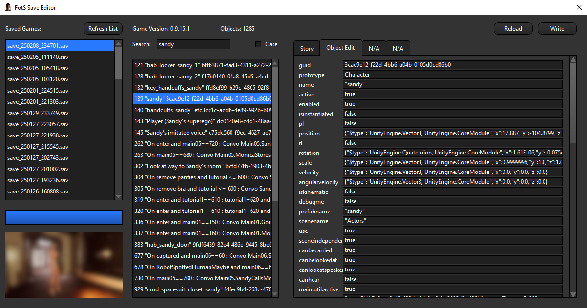

## About
This is an unofficial save file editor for Marine Kelley's game Flight of the Swallow.

It is early in development so please understand there will be bugs and odd behavior.

The goal of this utility is to make manipulating the game saves easy and useful for players and testers to assist Marine with troubleshooting.

If you have a feature request or bug to report I would love to hear about it either on Discord at twisty3780 or by filing an issue here on Github.

## Changelog

### Version 0.2
- Added Story tab to make changes to the main story object.

### Version 0.1 pre-release
- Added basic property editing
